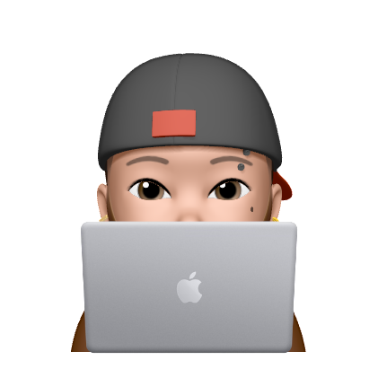

#  Michele Abategiovanni

**`Jr. Full-Stack Web Developer`**

 

<h2>Hello There!  👋</h2> 

I'm a 24 years old and I live in Naples (Italy🇮🇹).

 I'm a junior full-stack developer, passionate about technology, computer science and videogames.

All coding projects are built from the ground up, from planning and designing all the way to solving real-life problems with code.

 

###  Languages and Tools 

